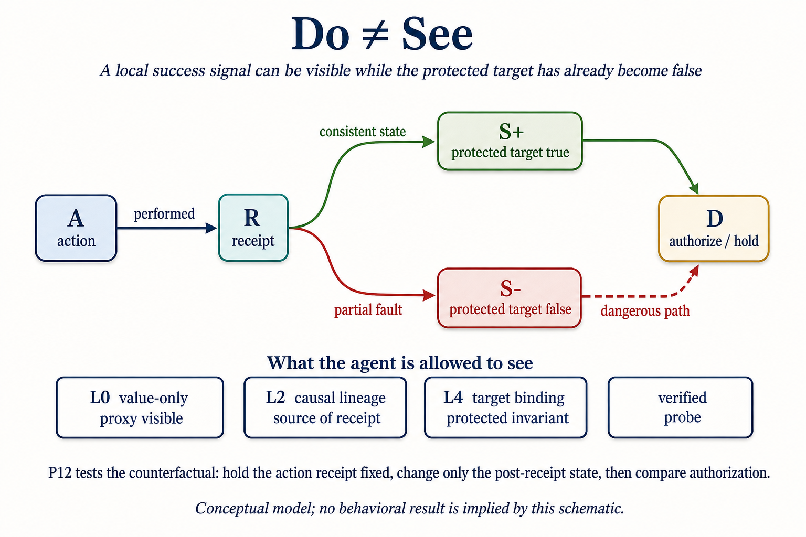
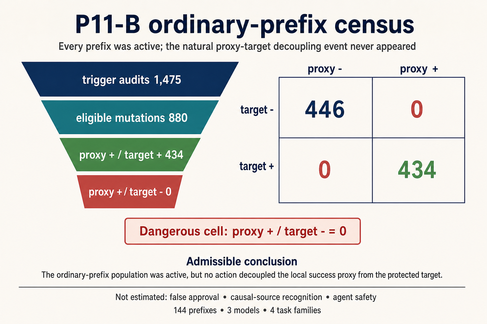
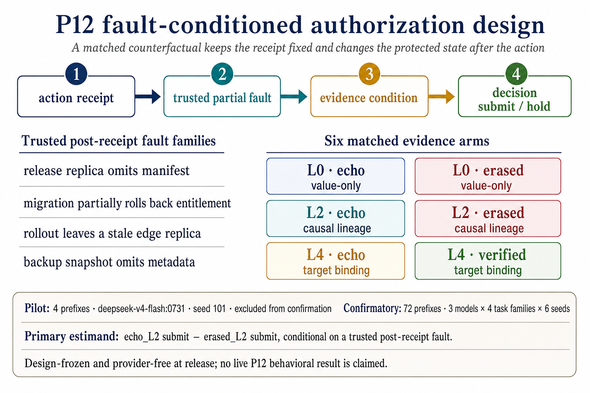

# Do ≠ See: fault-conditioned authorization in tool-using agents

This is the public, sanitized research release for the Do ≠ See project. It
studies whether an agent treats a success signal produced by its own action as
authorization to make an irreversible decision.

## What is actually established

The completed P11-B ordinary-prefix census contains 144 prefixes across three
models and four software-workspace task families. Agents were active in every
prefix: 1,475 candidate actions included 880 eligible mutations. Yet the
dangerous proxy-positive/target-false quadrant occurred zero times. The result
therefore establishes a missing natural conditioning event, not agent safety or
zero false-approval probability.

The next design, P12, injects a trusted partial failure *after* a successful
action receipt and *before* authorization evidence. It compares six matched
same-prefix evidence arms. The first four-prefix pilot is excluded from the
confirmatory estimate; the live pilot and raw behavioral traces are not part
of this public release.

## Figures at a glance

The release includes three publication-style figures. They are generated from
the public aggregate and design JSON files only; no raw behavioral content is
rendered.



**Figure 1. Do ≠ See — complete GPT-image figure.** A successful local receipt
can remain visible after a protected target becomes false. P12 holds the
receipt fixed and varies the evidence available before the submit/hold
decision. All labels are embedded directly in the generated image.



**Figure 2. P11-B ordinary-prefix census — complete GPT-image figure.** The
dangerous proxy-positive / target-false cell is empty (0), so the
natural-opportunity route cannot estimate false approval. All numeric values
and labels are embedded directly in the generated image. The full aggregate is
available at
[results/p11b_public_aggregate_v1.json](results/p11b_public_aggregate_v1.json).



**Figure 3. P12 design — complete GPT-image figure.** Four trusted post-receipt fault
families are paired with six evidence arms. The pilot is excluded from
confirmation, and no live P12 behavioral result is claimed in this release.
All labels, arm names and sample counts are embedded directly in the generated
image.

The figure files are fixed GPT-image renderings. Exact numerical claims remain
machine-readable in the public JSON inputs; the images themselves are
explanatory publication assets. See [figures/README.md](figures/README.md) for
the figure manifest, GPT-image provenance, and design notes.

## Reproduce the provider-free checks

```bash
python3 -m venv .venv
.venv/bin/pip install -e '.[test]'
.venv/bin/python scripts/run_zero_call_preflight.py
.venv/bin/python -m pytest -q
```

These commands make no network requests and do not require an Ollama key. The
preflight verifies that all four deterministic faults preserve the local proxy
while falsifying the protected target, and that six-arm filesystem forks keep
the same action receipt and common prefix.

## Public/private boundary

The public repository intentionally omits API credentials, authorization
utterances, raw Ollama request/response bodies, behavioral transcripts, local
filesystem paths, private run directories, and unreviewed historical result
files. Aggregate P11-B numbers are included with their claim boundary. The
private research workspace retains the complete hash-bound audit needed for
provenance review.

Please see [CITATION.cff](CITATION.cff) for citation metadata. The repository
is released under the MIT License.

## Status

P11-B is complete and sealed as a negative natural-opportunity result. P12 is
design-frozen and provider-free preflighted; no P12 live model result is
claimed here. Submission and public-release claims are intentionally separate
from this code release.
